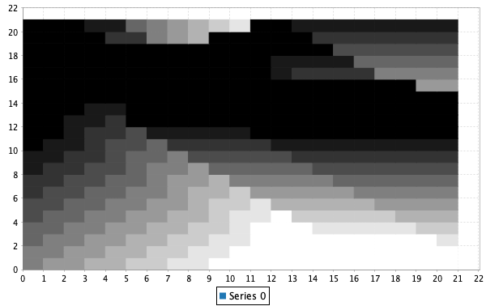

# Chapter 4

All images are generated using this library.

## Figure 4.1

The data for column 1 is generated by the function `figure4dot1column1`. 
The iterative policy evaluation is based on the pseudocode in the section 
`Iterative Policy Evaluation, for estimating V≈ vπ` with a couple of 
modifications. First, it uses the "in place" version discussed in §4.1. 
Second, we check to see if each delta is below our threshold before stopping.
Consequently the steps are multiples of ten and the rewards are not exactly 
the same as the figure in the book.
```
scala> figure4dot1column1()
==== step: 0 =====
State: 1,        Value: 0.0
State: 2,        Value: 0.0
State: 3,        Value: 0.0
State: 4,        Value: 0.0
State: 5,        Value: 0.0
State: 6,        Value: 0.0
State: 7,        Value: 0.0
State: 8,        Value: 0.0
State: 9,        Value: 0.0
State: 10,       Value: 0.0
State: 11,       Value: 0.0
State: 12,       Value: 0.0
State: 13,       Value: 0.0
State: 14,       Value: 0.0
State: T,        Value: 0.0
==== step: 10 =====
State: 1,        Value: -1.0
State: 2,        Value: -1.625
State: 3,        Value: 0.0
State: 4,        Value: 0.0
State: 5,        Value: -1.0
State: 6,        Value: -1.5
State: 7,        Value: 0.0
State: 8,        Value: 0.0
State: 9,        Value: -1.5
State: 10,       Value: -1.0
State: 11,       Value: 0.0
State: 12,       Value: -1.40625
State: 13,       Value: -1.625
State: 14,       Value: -1.0
State: T,        Value: 0.0
==== step: 20 =====
State: 1,        Value: -1.9957275390625
State: 2,        Value: -1.625
State: 3,        Value: -2.15625
State: 4,        Value: -1.431640625
State: 5,        Value: -2.35791015625
State: 6,        Value: -1.5
State: 7,        Value: -1.375
State: 8,        Value: -1.7265625
State: 9,        Value: -1.5
State: 10,       Value: -2.3359375
State: 11,       Value: -1.34375
State: 12,       Value: -1.40625
State: 13,       Value: -1.625
State: 14,       Value: -1.990234375
State: T,        Value: 0.0
==== step: 30 =====
State: 1,        Value: -1.9957275390625
State: 2,        Value: -3.17510986328125
State: 3,        Value: -3.8640213012695312
State: 4,        Value: -2.513411045074463
State: 5,        Value: -2.35791015625
State: 6,        Value: -2.9234619140625
State: 7,        Value: -2.949615478515625
State: 8,        Value: -3.2640933990478516
State: 9,        Value: -3.0113525390625
State: 10,       Value: -2.3359375
State: 11,       Value: -2.4073257446289062
State: 12,       Value: -2.8868179321289062
State: 13,       Value: -3.008209228515625
State: 14,       Value: -1.990234375
State: T,        Value: 0.0
==== step: 40 =====
State: 1,        Value: -2.94545641541481
State: 2,        Value: -4.5785723477602005
State: 3,        Value: -3.8640213012695312
State: 4,        Value: -2.513411045074463
State: 5,        Value: -3.6109882593154907
State: 6,        Value: -4.329701811075211
State: 7,        Value: -2.949615478515625
State: 8,        Value: -3.2640933990478516
State: 9,        Value: -4.366596132516861
State: 10,       Value: -3.5830936431884766
State: 11,       Value: -2.4073257446289062
State: 12,       Value: -4.331745291128755
State: 13,       Value: -4.289251901209354
State: 14,       Value: -2.8953843116760254
State: T,        Value: 0.0
==== step: 50 =====
State: 1,        Value: -3.8233568502837443
State: 2,        Value: -4.5785723477602005
State: 3,        Value: -5.352208020165563
State: 4,        Value: -3.435840192832984
State: 5,        Value: -4.769398637959966
State: 6,        Value: -4.329701811075211
State: 7,        Value: -4.387666083872318
State: 8,        Value: -4.6189614669419825
State: 9,        Value: -4.366596132516861
State: 10,       Value: -4.7340509057976305
State: 11,       Value: -3.3445213679224253
State: 12,       Value: -4.331745291128755
State: 13,       Value: -4.289251901209354
State: 14,       Value: -3.7296717796707526
State: T,        Value: 0.0
==== step: 60 =====
State: 1,        Value: -3.8233568502837443
State: 2,        Value: -5.842889803014259
State: 3,        Value: -6.67836049816151
State: 4,        Value: -4.260711547935813
State: 5,        Value: -4.769398637959966
State: 6,        Value: -5.617421993847529
State: 7,        Value: -5.675454366451959
State: 8,        Value: -5.837607360950301
State: 9,        Value: -5.6029157279772335
State: 10,       Value: -4.7340509057976305
State: 11,       Value: -4.188506660043004
State: 12,       Value: -5.692712056049004
State: 13,       Value: -5.488396174996524
State: 14,       Value: -3.7296717796707526
State: T,        Value: 0.0
==== step: 70 =====
State: 1,        Value: -4.623087045827271
State: 2,        Value: -6.98165150799213
State: 3,        Value: -6.67836049816151
State: 4,        Value: -4.260711547935813
State: 5,        Value: -5.82610153001108
State: 6,        Value: -6.782268684965482
State: 7,        Value: -5.675454366451959
State: 8,        Value: -5.837607360950301
State: 9,        Value: -6.734183526585634
State: 10,       Value: -5.78462904038463
State: 11,       Value: -4.188506660043004
State: 12,       Value: -6.956755743661711
State: 13,       Value: -6.603991501598534
State: 14,       Value: -4.5006742487629765
State: T,        Value: 0.0
==== step: 80 =====
State: 1,        Value: -5.34793908614616
State: 2,        Value: -6.98165150799213
State: 3,        Value: -7.868202766637815
State: 4,        Value: -5.008531905682564
State: 5,        Value: -6.787017790765237
State: 6,        Value: -6.782268684965482
State: 7,        Value: -6.831147552405488
State: 8,        Value: -6.947314544783364
State: 9,        Value: -6.734183526585634
State: 10,       Value: -6.742049318380593
State: 11,       Value: -4.951070813208281
State: 12,       Value: -6.956755743661711
State: 13,       Value: -6.603991501598534
State: 14,       Value: -5.211678767185526
State: T,        Value: 0.0
==== step: 90 =====
State: 1,        Value: -5.34793908614616
State: 2,        Value: -8.00831497579049
State: 3,        Value: -8.939076159219539
State: 4,        Value: -5.689515780593672
State: 5,        Value: -6.787017790765237
State: 6,        Value: -7.835466542385863
State: 7,        Value: -7.871471918659362
State: 8,        Value: -7.962513425926884
State: 9,        Value: -7.770093288881933
State: 10,       Value: -6.742049318380593
State: 11,       Value: -5.641148012562059
State: 12,       Value: -8.124113964359678
State: 13,       Value: -7.635629825331925
State: 14,       Value: -5.211678767185526
State: T,        Value: 0.0
==== step: 1239 =====
State: 1,        Value: -12.565744486448882
State: 2,        Value: -18.12302678535987
State: 3,        Value: -19.45525825543796
State: 4,        Value: -12.755656585420759
State: 5,        Value: -16.57552693800331
State: 6,        Value: -18.34884646977278
State: 7,        Value: -18.12213465323317
State: 8,        Value: -18.692806240580445
State: 9,        Value: -18.634068977135065
State: 10,       Value: -16.57546635807479
State: 11,       Value: -12.56541826247286
State: 12,       Value: -20.69108065684145
State: 13,       Value: -18.69335223966473
State: 14,       Value: -12.755782952800676
State: T,        Value: 0.0
```
## Exercise 4.1

We want to know the value of q<sub>π</sub>(11, `down`) and q<sub>π</sub>(7, 
`down`).

Notice that we only have V<sub>π</sub>, not q<sub>π</sub>. However, 
q<sub>π</sub>(s, a) = V<sub>π</sub>(s') when an action is deterministic. 
That is, the value of the action-value function, q<sub>π</sub>(s, a), is the 
value of the state that the agent ends up in (s') because 
of taking an action (a) from a state (s). So, for the first question, we can 
just ask what is the value of the terminal state V(T) because taking the 
action `down` from state 11 deterministcally results in the agent being in 
the terminal state. Similarly, for the second question, we can  ask what 
is the value of V(11).

A1: q<sub>π</sub>(11, `down`) = 0

A2: q<sub>π</sub>(7, `down`) = -14 (using the figure from the book)

## Exercise 4.2

If we added a new state, 15, what would the value of that state be if it had 
equiprobable transition probabilities and `left` took it to 12, `up` took it to 
13, `right` took it to 14, and `down` took it to 15, where 15 is unreachable from 
any other state?

We start with
V<sub>π</sub>(15) = 0.25 * -22 + 0.25 * -20 + 0.25 * -14 + 0.25 * -1
where -1 is the initial value of state 15.

But notice the initial value needs to be updated to the new 
value of state 15, i.e., -14.25. Once it's updated, we need to update it 
again until the number stabilizes. Eventually we get to about -18.7.

```
scala> exercise4dot2a()  
List(
  (1,-12.565744486448882), 
  (2,-18.12302678535987), 
  (3,-19.45525825543796), 
  (4,-12.755656585420759), 
  (5,-16.57552693800331), 
  (6,-18.34884646977278), 
  (7,-18.12213465323317), 
  (8,-18.692806240580445), 
  (9,-18.634068977135065), 
  (10,-16.57546635807479), 
  (11,-12.56541826247286), 
  (12,-20.692079948482018), 
  (13,-18.69335223966473), 
  (14,-12.755782952800676), 
  (15,-18.71260436321267), 
  (T,0.0)
)
```

V<sub>π</sub>(15) = -19

What if 15 is reachable from 13 via the `down` action?

One thing to consider is that this should change the value of state 13. 
(13, `down`) used to result in state 13 with a value of -20, but now it 
results in state 15, with a value of -19. Notice, though, that given 
the other three states accesible from 13's values, it shouldn't change much.
Additionally, given that (15, `up`) results in state 13, state 15's value should 
not change much either.

```
scala> exercise4dot2b()
List(
  (1,-12.5689587140348), 
  (2,-18.127199212368986), 
  (3,-19.459525978374142), 
  (4,-12.760257310189617), 
  (5,-16.580914340575745), 
  (6,-18.353833863465105), 
  (7,-18.126443612688817), 
  (8,-18.701129811565607), 
  (9,-18.64266864092394), 
  (10,-16.581499206993968), 
  (11,-12.568895166672771), 
  (12,-20.70360810574916), 
  (13,-18.707936021807637), 
  (14,-12.762693560676428), 
  (15,-18.723698590818472), 
  (T,0.0)
)
```

In fact, if you compare the output of `figure4dot1column1()` and 
`exercise4dot2b()` you'll notice it doesn't change significantly. One helpful 
way to think about why this is the case is to imagine that 15 was as stated 
above in each of the problems except that `up` took it to 9. Then 15 and 13 
would have the same actions resulting in the same states with the same values. 
So, the only difference between 15 and 13 is the `up` action which does not 
affect the value much at all.

## Exercise 4.3

Write the analgous equation for the following, but for q<sub>π</sub>(s,a):

4.3] V<sub>π</sub>(s) ≐ E[R<sub>t+1</sub> + γV<sub>π</sub>(S<sub>t+1</sub>) | S<sub>t</sub> = s]

4.4] V<sub>π</sub>(s) ≐ ∑<sub>a</sub>π(a|s)∑<sub>s',r</sub>p(s', r | s, a)(r + γV<sub>π</sub>(s'))

4.5] V<sub>k+1</sub>(s) ≐ ∑<sub>a</sub>π(a|s)∑<sub>s',r</sub>p(s', r | s, a)(r + γV<sub>k</sub>(s'))

4.3] q<sub>π</sub>(s,a) ≐ E[R<sub>t+1</sub> + γ∑<sub>s',a'</sub>q<sub>π</sub>(s', a') | S<sub>t</sub> = s, A<sub>t</sub> = a]

4.4] q<sub>π</sub>(s,a) ≐ ∑<sub>s',r</sub>p(s', r | s, a)(r + γ∑<sub>a'</sub>π(a'|s')q<sub>π</sub>(s', a'))

4.5] q<sub>k+1</sub>(s,a) ≐ ∑<sub>s',r</sub>p(s', r | s, a)(r + γ∑<sub>a'</sub>π(a'|s')q<sub>k</sub>(s', a'))

## Exercise 4.4

What is the bug in the pseudcode for policy iteration? Presumably this is 
referring to the fact that π(s) is probabilistic. Notice that in the function 
`policyImprovement()` we compare all of the possible actions of π and π'. 
This avoids the possibility that, when there are two or more equally greedy 
options, we compare two different actions that are optimal and determine that 
we have not yet converged.

## Exercise 4.5

Policy Iteration
<pre>
Policy Evaluation:
Loop:
  Delta <- 0
  Loop for each s ∈ S:
    v <- V(s)
    V(s) <- ∑<sub>s',r</sub>p(s', r | s, π(s))(r + γV(s'))
    Delta <- max(Delta, |v - V(s)|)
until Delta < Theta

Policy Improvement:
policy-stable <- true
For each s ∈ S:
  old-action <- π(s)
  π(s) <- argmax<sub>a</sub>∑<sub>s',r</sub>p(s', r | s, a)[r + V(s')]
  If old-action ≠ π(s), then policy-stable <- false
If policy-stable, then stop and return V ≈ v, and π ≈ π<sub>*</sub>; else go to 2
</pre>

Action-Value Iteration
<pre>
Policy Evaluation:
Loop:
  Delta <- 0
  Loop for each s ∈ S:
    Loop for each a ∈ A(s):
      v <- Q(s,a)
      Q(s,a) <- ∑<sub>s',r</sub>p(s', r | s, a)(r + γ∑<sub>a'</sub>Q(s',a'))
      Delta <- max(Delta, |v - Q(s,a)|)
until Delta < Theta

Policy Improvement:
policy-stable <- true
For each s ∈ S:
  old-action <- π(s)
  π(s) <- ∑<sub>s',r</sub>p(s', r | s, a)[r + argmax<sub>a'</sub>Q(s',a')]
  If old-action ≠ π(s), then policy-stable <- false
If policy-stable, then stop and return V ≈ v, and π ≈ π<sub>*</sub>; else go to 2
</pre>

TODO: Write code showing each side-by-side

## Exercise 4.6

In policy improvement we'll need to set π(s) to the set of all actions where the 
probability for each action is ε/|A(s)| except for the actions which maximize the 
values which will get equal proportions of 1-ε/(|A(s)| - n) where n is the number 
of actions that maximize the value for that state.

In policy evaluation we'll need to change the assignment to V(s) such that it 
includes all of the actions. So something like 
V(s) <- ∑<sub>a</sub>p(a)∑<sub>s',r</sub>p(s', r | s, a)(r + γV(s'))

And finally, in the initialization we'll nned to set π(s) such that each action 
has at least ε/|A(s)| probability. A straightforward way to do that is to use a 
uniform policy which is an ε-soft policy.

## Exercise 4.7



## Exercise 4.8

This is a question that's very specific to the policy the book found. But notice 
that here we produce a very reasonable policy (consitent with others) that does 
not look like the policy in the book.

Two things to say then. First, the policy we generate here is easy to understand. 
The gambler should always bet the maximum. Imagine the gambler bet less than the 
maximum, then when they bet max - n, they would have a 0.4 chance of getting to 
max + max - n. Then the next bet, the best option is a 0.4 chance of the new max, 
viz. 0.4 * 0.4 for the two bets. It would be better then for 0.4 * 0.4 to be 
multiplied by the maximum since for each bet the probability decreases.

Second, why would such a curious policy as that produced in the text be produced? 
For a thorought explanation see 
[Li & Pyeatt](http://dl.ifip.org/db/conf/ifip12/iip2004/LiP04.pdf).

## Exercise 4.9

Notice that our sweep graph will look quite a bit different since our algorithm 
does not visit each state once for each sweep. Nonetheless the progression is 
similar.


