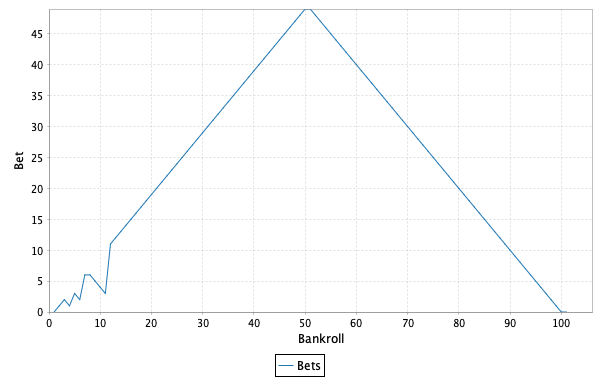
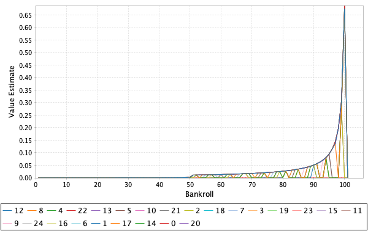

# Chapter 4

All images are generated using this library.

## Figure 4.1

The data for column 1 is generated by the function `figure4dot1column1`. 
The iterative policy evaluation is based on the pseudocode in the section 
`Iterative Policy Evaluation, for estimating V≈ vπ` with a couple of 
modifications. First, it uses the "in place" version discussed in §4.1. 
Second, we check to see if each delta is below our threshold before stopping.
Consequently the steps are multiples of ten and the rewards are not exact.

## Exercise 4.1

We want to know the value of qπ(11, `down`) and qπ(7, 
`down`).

Notice that we only have Vπ, not qπ. However, 
qπ(s, a) = Vπ(s') when an action is deterministic. 
That is, the value of the action-value function, qπ(s, a), is the 
value of the state that the agent ends up in (s') because 
of taking an action (a) from a state (s). So, for the first question, we can 
just ask what is the value of the terminal state V(T) because taking the 
action `down` from state 11 deterministcally results in the agent being in 
the terminal state. Similarly, for the second question, we can  ask what 
is the value of V(11).

A1: qπ(11, `down`) = 0

A2: qπ(7, `down`) = -14

## Exercise 4.2

If we added a new state, 15, what would the value of that state be if it had 
equiprobable transition probabilities and `left` took it to 12, `up` took it to 
13, `right` took it to 14, and `down` took it to 15, where 15 is unreachable from 
any other state?

We start with
Vπ(15) = 0.25 * -22 + 0.25 * -20 + 0.25 * -14 + 0.25 * -1

But notice the last term is -1. This needs to be updated to the new 
value of state 15, i.e., -14.25. Once it's updated, we need to update it 
again until the number stabilizes. Eventually we get to about -18.7.

Vπ(15) = -19

What if 15 is reachable from 13 via the `down` action?

One thing to consider is that this should change the value of state 13. 
(13, `down`) used to result in state 13 with a value of -20, but now it 
results in state 15, with a value of -19. Notice, though, that given 
the other three states accesible from 13's values, it shouldn't change much.
Additionally, given that (15, `up`) results in state 13, state 15's value should 
not change much either.

In fact, if you compare the output of `figure4dot1column1()` and 
`exercise4dot2b()` you'll notice it doesn't change significantly. One helpful 
way to think about why this is the case is to imagine that 15 was as stated 
above in each of the problems except that `up` took it to 9. Then 15 and 13 
would have the same actions resulting in the same states with the same values. 
So, the only difference between 15 and 13 is the `up` action which does not 
affect the value much at all.

## Exercise 4.3

Write the analgous equation for the following, but for qπ(s,a):

4.3] Vπ(s) ≐ E[Rt+1 + γVπ(St+1) | St = s]

4.4] Vπ(s) ≐ ∑aπ(a|s)∑s',rp(s', r | s, a)(r + γVπ(s'))

4.5] Vk+1(s) ≐ ∑aπ(a|s)∑s',rp(s', r | s, a)(r + γVk(s'))

4.3] qπ(s,a) ≐ E[Rt+1 + γVπ(St+1) | St = s, At = a]

4.4] qπ(s,a) ≐ ∑s',rp(s', r | s, a)(r + γVπ(s'))

4.5] qk+1(s,a) ≐ ∑s',rp(s', r | s, a)(r + γVk(s'))

## Exercise 4.4

What is the bug in the pseudcode for policy iteration? Presumably this is 
referring to the fact that π(s) is probabilistic. Notice that in the function 
`policyImprovement()` we compare all of the possible actions of π and π'. 
This avoids the possibility that, when there are two or more equally greedy 
options, we compare two different actions that are optimal and determine that 
we have not yet converged.

## Exercise 4.5

Policy Iteration
<pre>
Policy Evaluation:
Loop:
  Delta <- 0
  Loop for each s ∈ S:
    v <- V(s)
    V(s) <- ∑s',rp(s', r | s, π(s))(r + γV(s'))
    Delta <- max(Delta, |v - V(s)|)
until Delta < Theta

Policy Improvement:
policy-stable <- true
For each s ∈ S:
  old-action <- π(s)
  π(s) <- argmaxa∑s',rp(s', r | s, a)[r + V(s')]
  If old-action ≠ π(s), then policy-stable <- false
If policy-stable, then stop and return V ≈ v, and π ≈ π*; else go to 2
</pre>

Action-Value Iteration
<pre>
Policy Evaluation:
Loop:
  Delta <- 0
  Loop for each s ∈ S:
    Loop for each a ∈ A(s):
      v <- Q(s,a)
      Q(s,a) <- ∑s',rp(s', r | s, a)(r + γ∑a'Q(s',a'))
      Delta <- max(Delta, |v - Q(s,a)|)
until Delta < Theta

Policy Improvement:
policy-stable <- true
For each s ∈ S:
  old-action <- π(s)
  π(s) <- ∑s',rp(s', r | s, a)[r + argmaxa'Q(s',a')]
  If old-action ≠ π(s), then policy-stable <- false
If policy-stable, then stop and return V ≈ v, and π ≈ π*; else go to 2
</pre>

TODO: Write code showing each side-by-side

## Exercise 4.6

In policy improvement we'll need to set π(s) to the set of all actions where the 
probability for each action is ε/|A(s)| except for the actions which maximize the 
values which will get equal proportions of 1-ε/(|A(s)| - n) where n is the number 
of actions that maximize the value for that state.

In policy evaluation we'll need to change the assignment to V(s) such that it 
includes all of the actions. So something like 
V(s) <- ∑ap(a)∑s',rp(s', r | s, a)(r + γV(s'))

And finally, in the initialization we'll nned to set π(s) such that each action 
has at least ε/|A(s)| probability. A straightforward way to do that is to use a 
uniform policy which is an ε-soft policy.

## Exercise 4.7

`exercise4dot7()`

## Exercise 4.8

This is a question that's very specific to the policy the book found. But notice 
that here we produce a very reasonable policy (consitent with others) that does 
not look like the policy in the book.

Two things to say then. First, the policy we generate here is easy to understand. 
The gambler should always bet the maximum. Imagine the gambler bet less than the 
maximum, then when they bet max - n, they would have a 0.4 chance of getting to 
max + max - n. Then the next bet, the best option is a 0.4 chance of the new max, 
viz. 0.4 * 0.4 for the two bets. It would be better then for 0.4 * 0.4 to be 
multiplied by the maximum since for each bet the probability decreases.

Second, why would such a curious policy as that produced in the text be produced? 
For a thorought explanation see 
[Li & Pyeatt](http://dl.ifip.org/db/conf/ifip12/iip2004/LiP04.pdf).

## Exercise 4.9

Notice that our sweep graph will look quite a bit different since our algorithm 
does not visit each state once for each sweep. Nonetheless the progression is 
similar.

