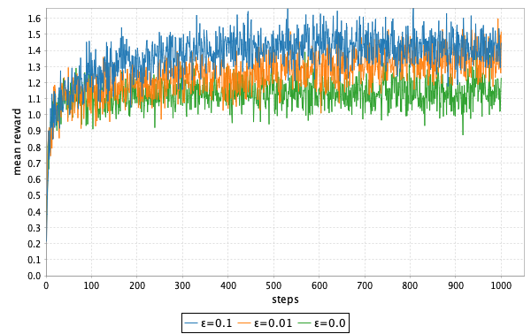
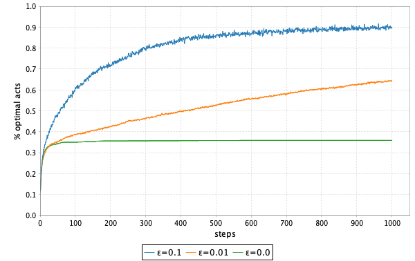
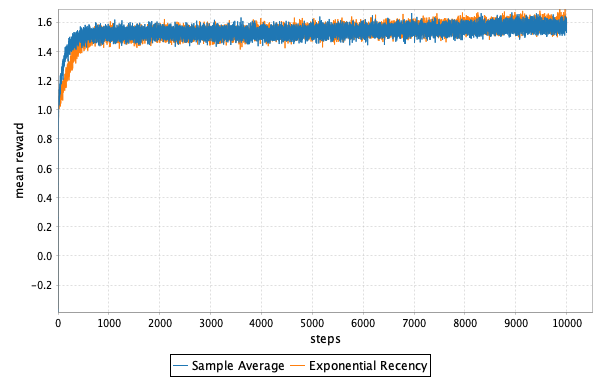
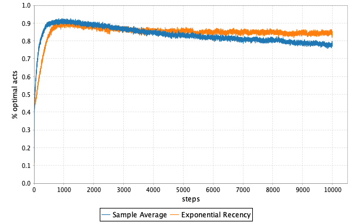

# Chapter 2

All images are generated using this library.

### Exercise 2.1

In Exercise 2.1 we're asked what the probability is that the greedy action 
is selected in a 2-armed bandit with ε=0.5. Presumably the question is of 
the long run probability in which case it's easy to see that the answer is 
0.75. 

The greedy action will be selected 0.5 percent of the time. The other 
0.5 percent of the time one of the two arms will be selected at random. 
Thus each of the arms will be selected 50% of the exploration time, which 
means the greedy arm will be selected 0.5 * 0.5 of the exploration time, or 
0.25. Add that to the greedy 0.5 and you get 0.75.

### Exercise 2.2

Exercise 2.2 is a walk through a concrete set of steps where we want to 
see if it's possible to tell whether the action was selected as part of 
exploration or as part of exploitation in an ε-greedy algorithm. Here 
is the sequence we're given: 
A1 = 1, R1 = 1, 
A2 = 2, R2 = 1, 
A3 = 2, R3 = 2, 
A4 = 2, R4 = 2, 
A5 = 3, R5 = 0

Assuming there are four actions each with Q1(a)=0. We know 
that the first action could be either greedy or exploratory since the 
selection is the same for both given all actions are greedy options, 
i.e., they all have the same value, 0, and it's the highest value. 
And when all options are greedy options an action is randomly selected.
Of course, in exploration an action is also randomly selected.

A1 is either.

Now we have Q(1) = 1 and the rest are 0. If the next action was the 
result of exploitation, it woule be 1. But it's not, it's 2, so it 
must be exploration.

A2 is exploratory.

Now Q(1) = 1, Q(2) = 1, Q(3) = 0, and Q(4) = 0.

2 is selected and it is tied for the maximum value. That means it 
could have been selected during exploitation, but since it's always 
possible that an action is chosed during exploration, that is also 
an option.

A3 is either.

Now Q(1) = 1, Q(2) = 3/2, Q(3) = 0, and Q(4) = 0.

In the fourth step, 2 is selected. This time it is the only maximum 
value, but for the same reasons as the previous step it could be the 
result of either exploration or the exploitation.

A4 is either.

Now Q(1) = 1, Q(2) = 5/3, Q(3) = 0, and Q(4) = 0.

Finally on the 5th step, 3 is chosen. 3 is not a maximum valued arm 
and thus must have been selected during exploration.

A5 is exploratory.

### Figure 2.2

In Figure 2.2 we see two graphs. The first shows the average reward for 
three different parameters of the ε-greedy algorithm. This is reproduced 
here using the Scala 3 reinforcement learning harness.

[]
[]

### Exercise 2.5

Exercise 2.5 asks us to generate plots like those in Figure 2.2 except 
for a non-stationary problem. We are supposed to compare the sample 
average method with other averaging methods.

[]
[]
